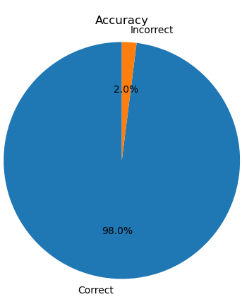

# English text proofreading

​                                                                                                                               

[TOC]


## Introduction：

​		在这次大作业中，我将要使用2元语法模型，来设计一个简单的英文单词纠错系统。在介绍部分，我将要给出具体的算法设计思路：

1. 数据准备：
   - 收集大规模的英文文本数据，包括正确的英文文本。你可以使用公开可用的语料库，如维基百科、英语书籍、新闻文章等。
   - 清洗和预处理数据，去除标点符号、转换为小写字母。
   - 找到一个英文词典，来检测单词拼写是否正确。
2. 构建2-gram语法模型：
   - 我将要考虑的上下文的长度为2
   - 对语料库中的文本进行分词，将文本划分为单词的序列，这里将要用到(NLTK)库，以为我觉得我还没有能力去写出一个完美的分词模型。
   - 统计每个2-gram的出现频率，并记录下它们的上下文。
   - 计算每个2-gram的概率，这里将要使用Laplace平滑的方法来统计频率，并且让频率代替概率。
3. 拼写纠正：
   - 接收用户输入的文本。
   - 去除用户输入文本中的标点符号，还远大小写等。
   - 将文本分解为单词，这里依然使用NLTK库来实现。
   - 对于每个单词，检查它是否存在于词典中。如果存在，说明拼写正确，可以跳过该单词。
   - 如果单词不在词典中，则认为它可能存在拼写错误。执行以下步骤来进行拼写纠正：
     - 生成可能的候选纠正：通过插入、删除、替换等操作，生成与输入单词编辑距离相对最短的所有可能的候选纠正。
     - 对于每个候选纠正，找到其对应的上下文（2-gram上下文）。
     - 根据2-gram语法模型中的概率计算每个候选纠正的概率。
     - 选择具有最高概率的候选纠正作为最终的纠正结果。
4. 输出结果：
   - 将纠正后的文本返回给用户，包括纠正后的单词、原始单词和纠正建议。

##  Related algorithms：

###  一：Punctuation removal：


​		使用正则表达式匹配标点符号，并且将它替换为空格，python代码示例如下：							

```python
import re

def remove_punctuation(text):
    # 定义正则表达式模式，匹配标点符号
    pat = r"[^\w\s]"
    # 使用正则表达式替换标点符号为空格
    processed_text = re.sub(pat, "", text)
    return processed_text

# 示例用法
text = "Hello, Miss SunZhenzhen! I am your student."
processed_text = remove_punctuation(text)
print(processed_text) #output='Hello Miss SunZhenzhen I am your student'
```

###  二：Uppercase letters are converted to lowercase letters：


​		可以使用Python字符串的`lower()`方法将字符串中的大写字母转换为小写字母，python代码示例如下：

```python
def convert_to_lowercase(text):
    lowercase_text = text.lower()
    return lowercase_text

# 示例用法
text = "Hello, Baby!"
lowercase_text = convert_to_lowercase(text)
print(lowercase_text)  #output='hello, baby!''
```

###  三：English word lookup algorithm (look up words from English dictionaries to see if words are spelled correctly)：


​		这里我们找到的词典数据集是一个json格式的文件，包含了35w个英文单词，见网址（https://raw.githubusercontent.com/dwyl/english-words/master/words_dictionary.json），以下算法可以从词典中匹配我们的单词：

```python
import json

def search_word_in_json(json_file, target_word):
    with open(json_file, 'r') as file:
        data = json.load(file)  # 读取JSON数据
    # 在JSON数据中查找目标单词
    found = False
    for word in data:
        if word == target_word:
            found = True
            break
    return found

# 示例用法
json_file = 'words_dictionary.json'  # JSON文件路径
target_word = 'Sky'  # 目标单词
result = search_word_in_json(json_file, target_word)
print(result) #Output=True
```


### 四：Edit the distance：


​		所谓编辑距离就是一个单词替换为另一个单词所需要的最少操作次数，这里的操作，包括，插入，删除，替换等。这里我们给出编辑距离的python计算方法。

```python
def levenshtein_distance(string1, string2):
    size_x = len(string1) + 1
    size_y = len(string2) + 1
    '''初始化一个大小为(len(string1)+1) x (len(string2)+1)
    的矩阵，然后填充第一行和第一列。
    然后，对于每一个字符串中的字符，如果它们相等，
    那么这个位置的距离就是它的左上角的距离
    ，否则它就是它上方、左方和左上方的距离中的
    最小值加一。最后，矩阵的右下角的值就是两个字符串的编辑距离。'''
    matrix = [[0 for _ in range(size_y)] for _ in range(size_x)]

    for x in range(size_x):
        matrix [x][0] = x
    for y in range(size_y):
        matrix [0][y] = y

    for x in range(1, size_x):
        for y in range(1, size_y):
            if string1[x-1] == string2[y-1]:
                matrix [x][y] = min(
                    matrix[x-1][y] + 1,
                    matrix[x-1][y-1],
                    matrix[x][y-1] + 1
                )
            else:
                matrix [x][y] = min(
                    matrix[x-1][y] + 1,
                    matrix[x-1][y-1] + 1,
                    matrix[x][y-1] + 1
                )

    return matrix[size_x - 1][size_y - 1]

# Test the function
print(levenshtein_distance('apple', 'ant'))  # Output: 4
```


### 五：English participle：


​		NLTK（Natural Language Toolkit）是一个在Python中处理人类语言数据的库。它提供了许多实用的功能，其中之一就是分词（tokenization），即将一个句子分解为它的组成单词。下面是他的例子：

```python
import nltk

#如果是第一次使用需要先下载他的语料裤，使用以下代码
#nltk.download('punkt')

def tokenize_text(text):
    return nltk.word_tokenize(text)

# Test the function
text = "My name is Shun."
print(tokenize_text(text)) #result=['My', 'name', 'is', 'Shun', '.']
```

### 六：Bayesian algorithm：

#### Introduction:

​		[贝叶斯定理](https://baike.baidu.com/item/贝叶斯定理/1185949?fromModule=lemma_inlink)由英国数学家贝叶斯 ( Thomas Bayes 1702-1761 ) 发展，用来描述两个条件[概率](https://baike.baidu.com/item/概率?fromModule=lemma_inlink)之间的关系。假设现在我们有两个事件A和B

$$
P(A|B)=\frac {P(A,B)} {P(B)}
$$

$$
P(B|A)=\frac {P(A,B)}{P(A)}=\frac {P(A|B)P(B)}{P(A)}
$$

由加法公式可得：

$$
P(A)=ΣP(A|X_i)_{(X表示一个事件集合中所有的与A相关的但是非A事件集合，X_i表示X集合中的一个元素)}
$$

那么我们的:

$$
P(B|A)=\frac {P(A,B)}{P(A)}=\frac {P(A|B)P(B)}{ΣP(A|X_i)}
$$

#### Derivation：

##### Conditional probability:

​			首先我们来介绍一下条件概率，条件概率这个东西很简单啊。举一个简单的例子，就比如今天买一朵玫瑰花的概率是P(A),<sub>(A表示今天我买玫瑰花这一个事件)</sub>,那么在我买了一朵玫瑰花的条件下，我还会再买一朵玫瑰花嘛？可能会，也可能不会，但是，我们不得不承认，今天第一次买玫瑰花这一个事件确实对今天我第二次买玫瑰花产生了一定的影响，这很容易理解。因为我想如果没有特别特殊原因的话，我不会一天去买两朵玫瑰花，当然，除非我有两个女朋友，早上我去见了第一个女朋友，买了一束话，晚上又见了另一个女朋友，又买了一束花。好了，言归正转，现在我们要考虑我买第二朵玫瑰花发生的概率了，首先我们用这样一个符号来记录我们要得到的概率：

$$
P(B|A)
$$

很自然的，A代表的是我们今天第一次买玫瑰花的这个事件，B代表的是今天我们第二次买玫瑰花的这个事件。上面的值就代表的是，今天我在第一天买了玫瑰花的情况下，我们要第二次买到这个玫瑰花的概率。

##### Joint prob：

​			这串英文翻译过来就是叫联合概率，那么什么是联合概率呢？其实很容易理解，就像我们上面的玫瑰花一样，假设现在通过对我好几千年的观察，发现，我一天买一朵玫瑰花的概率是:<sub>(A为我每天买玫瑰花这个事件，a为具体的实例，i代表朵数)</sub>

$$
P(A=a_1)
$$

在这几千年的观察中，观察者还发现了一个事情，就是，我每天都要买几瓶可口可乐。那么我每天买几瓶可口可乐呢？经过观察统计发现，我每天买i瓶可乐的概率为：<sub>(B为我每天买可乐这个事件，b为具体的实例，i代表瓶数)</sub>

$$
P(B=b_i)
$$

哎，这样一来，新的问题就出现了：今天我买了两朵玫瑰花，同时又买了五瓶可乐这个事情发生的概率有多大。首先这个概率值我们记做：

$$
P(A=a_2,B=b_5)
$$


##### Product Rule：

​			按照我们通常的理解就是买可乐和买玫瑰花，这两个事件是毫无相干的，就像风马牛一样，不相及。也就是这两个事件的相互独立的，这个时候那么我们要的概率值就是：


$$
P(A=a_2,B=b_5)=P(A=a_2)P(B=b_5)
$$

可是，我个人感觉这两个事件并不是毫无相干的。因为，例如我今天买了999多玫瑰花去向我的女神表白，但是被拒绝了，在回来的路上十分的抑郁，剪不断，理还乱。这个时候，突然一抬头，一辆大卡车，出现在了我的面前，欧玛噶。我见了上帝，今天是喝不到可乐了。你看买玫瑰花，和我喝多少可乐是不是还是有联系的，对吧？虽然有一些牵强，但是还是有联系的，这个时候就不能按照上面那个公式来计算了，那么我们应该怎么计算呢？还是通过观察，经过长达九九八十一千年的观察，观察者发现，我每天买两朵花的概率是P（A=a<sub>2</sub>）,在我买完两朵玫瑰花后，又买五瓶可乐的概率是P(B=b<sub>5</sub>|A=a<sub>2</sub>)那么我买玫瑰花之前，我想知道我买了两朵玫瑰花同时又买了五瓶可乐的概率就是：

$$
P(A=a_2,B=b_5)=P(B=b_5|A=a_2)P(A=a_2)
$$

这个公式看起来可能有些抽象，但是其实没有那么难，他的本质还是两个事件的概率乘积，但是，对于两个有关联的事件，一个事件的概率会随着另一个事件的改变而改变，我们只是找到正确的概率值相乘而已。同样的，上面的公式我们找了B事件随着A事件的改变而改变的概率值，当然我们也可以尝试这找到事件A随着事件B概率的变换而变换的值，那么

$$
P(A=a_2,B=b_5)=P(B=b_5)P(A=a_2|B=b_5)=P(B=b_5|A=a_2)P(A=a_2)
$$

当然，对于多个事件，我们依然可以这样进行计算。假设现在我们有一个事件集合X，x<sub>i</sub>为该事件集合的具体摸一个事件，那么我们考虑多个随机事件的情况：

$$
P(X=x_1,X=x_2,X=x_3,...,X=x_i)=P(X=x_1)P(X=x_2,X=x_3,...,X=x_i|X=x_1)
$$

$$
=P(X=x_1)P(X=x_2|X=x_1)P(X=x_3,...,X=x_i|X=x_1,X=x_2)
$$

$$
=P(X=x_1)P(X=x_2|X=x_1)P(X=x_3,...,X=x_i|X=x_1,X=x_2)...P(X=x_i|X=x_1,...,X=x_{i-1})
$$


##### Bayes:

​			有了上面的一些内容，下面我们再来想这样一件事情。假设现在我已经知道了，我在买了两朵玫瑰花的情况下又买了两瓶可乐的概率为P(B=b<sub>5</sub>|A=a<sub>2</sub>)，即：

$$
P(B=b_5|A=a_2)
$$

那么我们能不能知道我在买了五瓶可乐的情况下，买了两多玫瑰花的概率呢？就是我们想要求得：

$$
P(A=a_2|B=b_5)
$$

我想这不会太难的，根据上面我们推导的乘法规则里的第三个式子：

$$
P(A=a_2,B=b_5)=P(B=b_5)P(A=a_2|B=b_5)=P(B=b_5|A=a_2)P(A=a_2)
$$

不难发现：

$$
P(A=a_2|B=b_5)=\frac{P(A=a_2,B=b_5)}{P(B=b_5)}=\frac{P(B=b_5|A=a_2)P(A=a_2)}{P(B=b_5)}
$$

我们已经知道了P(B=b<sub>5</sub>|A=a<sub>2</sub>)的值，那么我们只要求得P（A=a<sub>2</sub>)和P（B=b<sub>5</sub>）的值便可以计算出来我们想要的值。这便是贝叶斯公式，实际上它是很简单的。但是通常情况下我们碰到的情况可能要比这复杂很多。因为事务之间的联系不可能只有玫瑰花和可乐之间的联系，还有好多好多的情况。就比如我们要判断一对夫妻未来生出来的孩子长得漂亮还是不漂亮，那么我们可以参考的依据就有很多了，比如他爸爸的眼睛大小，他妈妈的眼睛大小，他爸爸的海拔，他妈妈的海拔等等有诸多的因素。所以往往我们要的这个公式是很长的：

$$
P(Y=y_i|x_1,x_2,x_3,...,x_i)=\frac{P(x_1,x_2,x_3,...,x_i|Y=y_i)P(Y=y_i)}{P(x_1,x_2,x_3,...,x_i)}
$$

我们按照乘法规则将他们展开：

$$
P(Y=y_i|x_1,x_2,x_3,...,x_i)=\frac{P(x_1|x_2,x_3...,x_i,Y=y_i)P(x_2|x_3,x_4...,x_i,Y=y_i)...P(x_i|Y=y_i)P(Y=Y_i)}{P(x_1,x_2,x_3,...,x_i)}
$$

这样看来，这个贝叶斯公式的计算难度还是很大，因为我们无法忽略这些X=(x<sub>1</sub>，x<sub>2</sub>，...，x<sub>i</sub>)内部之间的联系，就像可能1.6m的女生要找1.8m的男性一样，这个内部纯在着某种联系，因为1.6m的女性找一个1.5m的男性说啥豆不太合适，所以P(X=x<sub>i</sub>)这样的东西是很难算出来的。那么怎么办呢？


##### Naive Bayes：

​			为了解决上面的问题，我们就引出来朴素贝叶斯这个方法。所谓的朴素就是忽略掉X=(x<sub>1</sub>，x<sub>2</sub>，...，x<sub>i</sub>)内部之间的联系。也就是x<sub>1</sub>，x<sub>2</sub>，...，x<sub>i</sub>他们之间是相互独立的：

$$
P(x_1,x_2,x_3,...,x_i)=P(x_1)P(x_2)P(x_3)...P(x_i)
$$

同样的：

$$
P(x_1|x_2,x_3...,x_i,Y=y_i)=P(x_1|y_i)
$$

所以我们将贝叶斯公式变为朴素贝叶斯公式就是：

$$
P(Y=y_i|x_1,x_2,x_3,...,x_i)=\frac{P(x_1|Y=y_i)P(x_2|Y=y_i)..P(x_i|Y=y_i)P(Y=Y_i)}{P(x_1,x_2,x_3,...,x_i)}
$$

在机器学习里面，我们要判断事件Y是属于哪一个类别，我们可以分别计算出：

$$
P(Y=y_1|x_1,x_2,x_3,...,x_i)
$$

$$
P(Y=y_2|x_1,x_2,x_3,...,x_i)
$$

$$
...
$$

$$
P(Y=y_i|x_1,x_2,x_3,...,x_i)
$$


然后将他们的概率值进行比较，取概率值最大的为我们预测的结果。在计算的过程中不难发现，他们的分母都是一样的，都是P(x<sub>1</sub>，x<sub>2</sub>，...，x<sub>i</sub>)，所以其实我们只需要计算分子部分作比较就可以了，就是这一部分：

$$
P(x_1|Y=y_i)P(x_2|Y=y_i)...P(x_i|Y=y_i)*P(Y=y_i)
$$

这便是我们朴素贝叶斯公式的推导全过程了。下面我们来讨论一些再计算的时候可能出现的问题。


### 七：Laplacian smoothing：


​			拉普拉斯平滑，其实也很简单。假设现在`我们有一个随机变量X，其取值范围为（1，2，3，...，i）在进行了k次观察后，其对应的实验结果为Y=(y<sub>1</sub>，y<sub>2</sub>，...，y<sub>k</sub>),那么P(Y=y<sup>m</sup>)的极大似然估计值就是：

$$
P(Y=y^m)=\frac{Σ\Pi(Y=y^m)}{k}
$$

这很容易理解，就是Y=y<sup>m</sup>的数量除以观测的次数。这个是没有做拉普拉斯平滑之前的数值，做拉普拉斯平滑之后就变成了：(α为平滑系数，通常为1)

$$
P(Y=y^m)=\frac{Σ\Pi(Y=y^m)+1\alpha}{k+i\alpha}
$$

那怎么理解这个拉普拉斯平滑呢？说白了其实就是为了避免零概率的出现，我们在原来的分子上加1，同时为了减小分子加1对数据整体统计规律产生的影响，我们在其分母部分加上该随机变量可能的取值的个数。至于为什么，我还没有参悟。

## Experiment：

#### 一：Data preparation:

##### Dictionary:

​		这里我们找到的词典数据集是一个json格式的文件，包含了35w个英文单词，见网址（https://raw.githubusercontent.com/dwyl/english-words/master/words_dictionary.json）

##### Sentence:

​		网上找的数据集动不动好几个g，实在是太大，因此为了简单，我们使用算法来随机生成一千条数据，实验代码如下：

```python
import random

# 句子模板
templates = [
    "The {noun} {verb} {adjective}.",
    "I {verb} {adverb}.",
    "She {verb} the {noun} {adverb}.",
    "He {verb} {adjective} {noun}.",
    "They {verb} {noun} {adverb}."
]

# 单词列表
nouns = ["cat", "dog", "house", "car", "book"]
verbs = ["runs", "jumps", "sleeps", "reads", "eats"]
adjectives = ["big", "small", "red", "blue", "happy"]
adverbs = ["quickly", "slowly", "loudly", "quietly", "happily"]

# 生成1千条语句
sentences = []
for _ in range(1000):
    template = random.choice(templates)
    sentence = template.format(
        noun=random.choice(nouns),
        verb=random.choice(verbs),
        adjective=random.choice(adjectives),
        adverb=random.choice(adverbs)
    )
    sentences.append(sentence)

# 输出语句
for sentence in sentences:
    print(sentence)
```

#### 二：Environment：

$$
python3.9,\quad math,\quad pygame,\quad pygame\_gui,\quad random, \quad nltk
$$

#### 三：Result：

在训练预料的词汇范围内，通过验证100条数据，得到了百分之九十八的正确率，如下图所示：



#### 四：Show Time：


#### 五：Experience:

​       在本次实验当中复习了上课时学到的很多知识，比如N元语法模型，正则表达式等等，让我对那些知识的认识更加深刻了，收获慢慢。这个实验中不但有一些算法相关的内容，还设计了一个相对好看的图形交互界面，这是我目前人生当中做过最好看的一个了，哈哈哈。当然实验也有一些不足，就是没有对训练的参数进行一个保存，某一个调用都要重新训练一次，所以当有错误的时候就会有些卡顿，其实那是在计算的过程，哈哈哈。

#### 六：Code：

```python
import json
import re
from collections import defaultdict
import nltk
import math
import random
import pygame
import pygame_gui

def remove_punctuation(text):
    '''将标点符号替换成空格'''
    # 定义正则表达式模式，匹配标点符号
    pat = r"[^\w\s]"
    # 使用正则表达式替换标点符号为空格
    processed_text = re.sub(pat, "", text)
    return processed_text

def get_previous_word(sentence, target_word):
    '''找到某一个句子中的某一个单词的前一个单词'''
    words = sentence.split()  # split the sentence into words
    if target_word in words:
        target_index = words.index(target_word)
        if target_index > 0:  # check if the target word is not the first word
            return words[target_index - 1]
        else:
            return "Target word is the first word in the sentence."
    else:
        return "Target word not found in the sentence."


def convert_to_lowercase(text):
    '''将句子中的大写字母换成小写字母'''
    lowercase_text = text.lower()
    return lowercase_text


def search_word_in_json(json_file, target_word):
    '''判断一个单词是否拼写错误'''
    with open(json_file, 'r') as file:
        data = json.load(file)  # 读取JSON数据

    # 在JSON数据中查找目标单词
    found = False
    for word in data:
        if word == target_word:
            found = True
            break
    return found


def levenshtein_distance(string1, string2):  #计算编辑距离
    '''计算两个单词的编辑距离'''
    size_x = len(string1) + 1
    size_y = len(string2) + 1
    matrix = [[0 for _ in range(size_y)] for _ in range(size_x)]

    for x in range(size_x):
        matrix [x][0] = x
    for y in range(size_y):
        matrix [0][y] = y

    for x in range(1, size_x):
        for y in range(1, size_y):
            if string1[x-1] == string2[y-1]:
                matrix [x][y] = min(
                    matrix[x-1][y] + 1,
                    matrix[x-1][y-1],
                    matrix[x][y-1] + 1
                )
            else:
                matrix [x][y] = min(
                    matrix[x-1][y] + 1,
                    matrix[x-1][y-1] + 1,
                    matrix[x][y-1] + 1
                )

    return matrix[size_x - 1][size_y - 1]


def tokenize_text(text):          #分词
    '''对所给的文本进行分词'''
    return nltk.word_tokenize(text)

def find_closest_words(json_file, target_word): ##找到字典中编辑距离最近的单词
    '''找到字典中编辑距离最近的词'''
    with open(json_file, 'r') as file:
        data = json.load(file)  # 读取JSON数据

    closest_words = []
    min_distance = float('inf')

    for word in data:
        word_distance = levenshtein_distance(word, target_word)
        if word_distance < min_distance:
            closest_words = [word]
            min_distance = word_distance
        elif word_distance == min_distance:
            closest_words.append(word)

    return closest_words

def create_sentences():
    '''创建一千条数据用于训练2元语法模型'''
    templates = [
        "the {noun} {verb} {adjective}",
        "i {verb} {adverb}",
        "she {verb} the {noun} {adverb}",
        "he {verb} {adjective} {noun}",
        "they {verb} {noun} {adverb}"
    ]
    # 单词列表
    nouns = ["cat", "dog", "house", "car", "book"]
    verbs = ["runs", "jumps", "sleeps", "reads", "eats","like"]
    adjectives = ["big", "small", "red", "blue", "happy"]
    adverbs = ["quickly", "slowly", "loudly", "quietly", "happily"]

    # 生成1千条语句
    sentences = []
    for _ in range(1000):
        template = random.choice(templates)
        sentence = template.format(
            noun=random.choice(nouns),
            verb=random.choice(verbs),
            adjective=random.choice(adjectives),
            adverb=random.choice(adverbs)
        )
        sentences.append(sentence)
    return sentences

def create_sentences_wrong():
    '''创建一百条含有错误单词的数据用于测试2元语法模型'''
    templates = [
        "the {noun} {verb} {adjective}",
        "i {verb} {adverb}",
        "she {verb} the {noun} {adverb}",
        "he {verb} {adjective} {noun}",
        "they {verb} {noun} {adverb}"
    ]
    # 单词列表
    nouns = ["cat", "dog", "house", "car", "book"]
    verbs = ["runs", "jumps", "sleeps", "reads", "eats", "like"]
    adjectives = ["bng", "smhll", "rpd", "blke", "habpy"]
    adverbs = ["quickly", "slowly", "loudly", "quietly", "happily"]

    # 生成1千条语句
    sentences = []
    for _ in range(10):
        template = random.choice(templates)
        sentence = template.format(
            noun=random.choice(nouns),
            verb=random.choice(verbs),
            adjective=random.choice(adjectives),
            adverb=random.choice(adverbs)
        )
        sentences.append(sentence)
    return sentences


class BigramLanguageModel:
    '''实现添加了拉普拉斯平滑的二元语法模型'''
    def __init__(self, corpus):
        self.bigram_counts = defaultdict(int)  # 二元组出现的次数
        self.unigram_counts = defaultdict(int)  # 单个单词出现的次数
        self.vocab_size = 0  # 词汇表大小

        # 统计二元组和单个单词的出现次数
        for sentence in corpus:
            tokens = sentence.split()
            prev_word = None
            for word in tokens:
                self.unigram_counts[word] += 1
                if prev_word:
                    bigram = (prev_word, word)
                    self.bigram_counts[bigram] += 1
                prev_word = word

        self.vocab_size = len(self.unigram_counts)

    def probability(self, word, prev_word):
        bigram = (prev_word, word)
        numerator = self.bigram_counts[bigram] + 1  # 拉普拉斯平滑，将计数加1
        denominator = self.unigram_counts[prev_word] + self.vocab_size  # 分母加上词汇表大小
        probability = numerator / denominator
        return probability


def Correct_errors(text_sentence='I like smhll'):

    '''训练二元语法模型'''
    train_sentences=create_sentences()
    model =BigramLanguageModel(train_sentences)
    dict_path='./words_dictionary.json'

    '''首先将输入的语句进行除去标点符号'''
    processed_text = remove_punctuation(text_sentence)

    '''将句子中的大写字母变成小写字母'''
    lowercase_text = convert_to_lowercase(processed_text)

    '''对输入的语句进行分词'''
    words=tokenize_text(lowercase_text)

    '''检查语句中是否有错误的单词，并将错误的单词返回到列表'''

    wrong=[]

    for i in words:
        target_word = i  # 目标单词
        result = search_word_in_json(dict_path, target_word)
        if not result:
            wrong.append(i)
    '''找到词典中与错误单词编辑距离最小的单词，并将他们全部放入到same_word列表中'''
    if wrong:
        for i in wrong:
            same_words = find_closest_words(dict_path, i)
            '''根据2元语法模型，找到概率值最大的单词'''
            count,pro=-1,0
            for j in same_words:
                probability = model.probability(j, get_previous_word(text_sentence, i))
                if probability>=pro:
                    count=count+1
                    pro=probability
                else:
                    continue
            return "I think you must do:"+i+"==>"+same_words[count]
    else:
        return "correct"

if __name__=='__main__':

    # Initialize Pygame
    pygame.init()

    # Set up some constants
    WIDTH, HEIGHT = 800, 600
    BACKGROUND_COLOR = (0, 0, 0)
    manager = pygame_gui.UIManager((WIDTH, HEIGHT))

    # Create the window
    window_surface = pygame.display.set_mode((WIDTH, HEIGHT))

    # Create a list of particles
    particles = []
    for _ in range(100):
        x = random.randrange(WIDTH)
        y = random.randrange(HEIGHT)
        dx = random.random() - 0.5
        dy = random.random() - 0.5
        r = random.randint(0, 255)
        g = random.randint(0, 255)
        b = random.randint(0, 255)
        particles.append([x, y, dx, dy, (r, g, b)])

    # Input and Output text boxes
    input_text_box = pygame_gui.elements.UITextEntryLine(relative_rect=pygame.Rect((50, 200), (500, 50)),
                                                         manager=manager)
    output_text_box = pygame_gui.elements.UITextEntryLine(relative_rect=pygame.Rect((300, 300), (450, 50)),
                                                          manager=manager)


    text = "English text proofreading"
    font_size = 50
    font = pygame.font.SysFont('Arial', font_size)
    # 文本位置
    text_x = WIDTH/5
    text_y = 50

    # Main game loop
    clock = pygame.time.Clock()
    running = True
    input_text_box.set_text('Entry a sentence')
    # 小人参数
    character_width = 60
    character_height = 120
    character_speed = 5

    # 小人1的初始位置和速度
    character1_x = 50
    character1_y = HEIGHT // 1.2
    character1_velocity = character_speed

    # 小人2的初始位置和速度
    character2_x = WIDTH - character_width - 50
    character2_y = HEIGHT // 1.2
    character2_velocity = character_speed

    # 小人图像
    character_image = pygame.image.load("character.png")
    character_image = pygame.transform.scale(character_image, (character_width, character_height))
    while running:
        time_delta = clock.tick(60) / 1000.0
        for event in pygame.event.get():
            if event.type == pygame.QUIT:
                running = False
            elif event.type == pygame.USEREVENT:
                if event.user_type == pygame_gui.UI_TEXT_ENTRY_FINISHED:
                    if event.ui_element == input_text_box:
                        # Here is where you can process the input text and output the results.
                        input_text=input_text_box.get_text()
                        output_text_box.set_text(Correct_errors(input_text))


            manager.process_events(event)

        manager.update(time_delta)

        # Fill the background
        window_surface.fill(BACKGROUND_COLOR)

        # Update and draw particles
        for particle in particles:
            particle[0] += particle[2]
            particle[1] += particle[3]
            if particle[0] < 0 or particle[0] > WIDTH or particle[1] < 0 or particle[1] > HEIGHT:
                particle[0] = random.randrange(WIDTH)
                particle[1] = random.randrange(HEIGHT)
                particle[2] = random.random() - 0.5
                particle[3] = random.random() - 0.5
            pygame.draw.circle(window_surface, particle[4], [int(particle[0]), int(particle[1])], 3)


        amplitude = 20  # 振幅
        frequency = 0.01  # 频率
        text_offset_y = int(amplitude * math.sin(frequency * pygame.time.get_ticks()))

        # 绘制文字
        text_surface = font.render(text, True, (65, 25, 60))
        window_surface.blit(text_surface, (text_x, text_y + text_offset_y))
        character1_x += character1_velocity
        if character1_x <= 0 or character1_x >= WIDTH - character_width:
            character1_velocity *= -1

        character2_x -= character2_velocity
        if character2_x <= 0 or character2_x >= WIDTH - character_width:
            character2_velocity *= -1
        window_surface.blit(character_image, (character1_x, character1_y))
        window_surface.blit(character_image, (character2_x, character2_y))
        manager.draw_ui(window_surface)
        pygame.display.update()

    pygame.quit()
```

